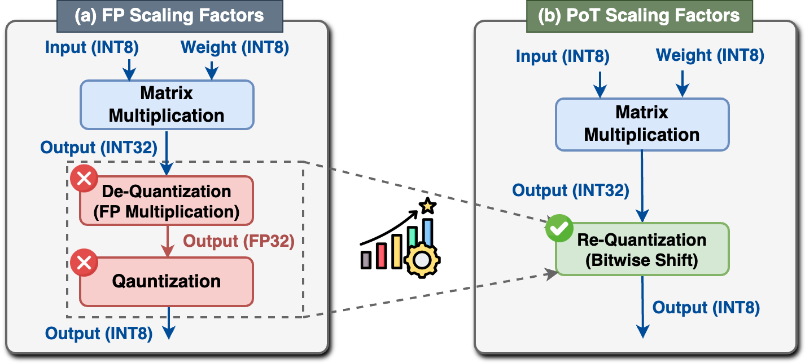
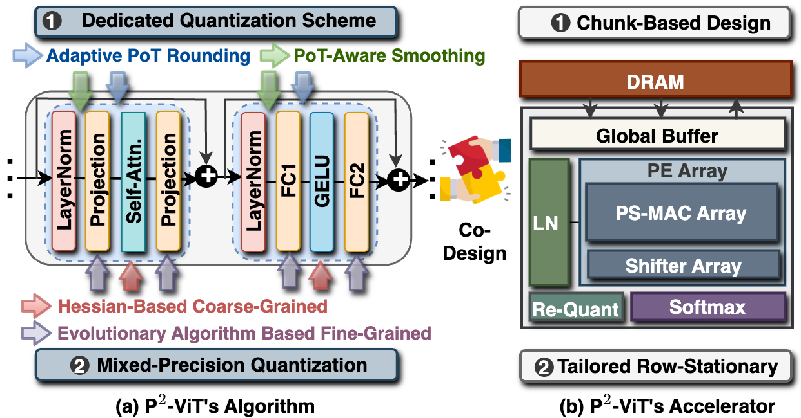

# P2-ViT

This repo contains the official implementation of **["P2-ViT: Power-of-Two Post-Training Quantization and Acceleration for Fully Quantized Vision Transformer"](https://arxiv.org/abs/2405.19915).**


## Abstract

Transformer-based architectures have achieved competitive performance in various CV tasks. Compared to the CNNs, Vision Transformers (ViTs) have excelled in computer vision tasks but are memory-consuming and computation-intensive, challenging their deployment on resource-constrained devices.
To tackle this limitation, prior works have explored ViT-tailored quantization algorithms but retained floating-point scaling factors, which yield non-negligible re-quantization overhead, limiting ViTs' hardware efficiency and motivating more hardware-friendly solutions. 
<div align=center>

</div>


To this end, we propose P$^2$-ViT, the first Power-of-Two (PoT) post-training quantization and acceleration framework to accelerate fully quantized ViTs.
Specifically, as for quantization, we explore a **dedicated quantization scheme** to effectively quantize ViTs with **PoT scaling factors**, thus minimizing the re-quantization overhead. Furthermore, we propose **coarse-to-fine automatic mixed-precision quantization** to enable better accuracy-efficiency trade-offs.
In terms of hardware, we develop a dedicated chunk-based accelerator featuring multiple tailored sub-processors to individually handle ViTs' different types of operations, alleviating reconfigurable overhead. Additionally, we design a tailored row-stationary dataflow to seize the pipeline processing opportunity introduced by our PoT scaling factors, thereby enhancing throughput.
<div align=center>

</div>

Extensive experiments consistently validate P$^2$-ViT's effectiveness. Particularly, we offer comparable or even superior quantization performance with PoT scaling factors when compared to the counterpart with floating-point scaling factors. Besides, we achieve up to $\mathbf{10.1\times}$ speedup and $\mathbf{36.8\times}$ energy saving over GPU's Turing Tensor Cores, and up to $\mathbf{1.84\times}$ higher computation utilization efficiency against SOTA quantization-based ViT accelerators.


## Quantization

### Run

Example: Evaluate quantized DeiT-S with MinMax quantizer.

```bash
python test_quant.py deit_small <YOUR_DATA_DIR> --quant --quant-method minmax
```

- `deit_small`: model architecture, which can be replaced by `deit_tiny`, `deit_base`, `vit_base`, `vit_large`, `swin_tiny`, `swin_small` and `swin_base`.

- `--quant`: whether to quantize the model.

- `--quant-method`: quantization methods of activations, which can be chosen from `minmax`, `ema`, `percentile` and `omse`.


## Citation

If you find this repo useful in your research, please consider citing the following paper:

```BibTex
@article{shi2024p,
  title={P$^2$-ViT: Power-of-Two Post-Training Quantization and Acceleration for Fully Quantized Vision Transformer},
  author={Shi, Huihong and Cheng, Xin and Mao, Wendong and Wang, Zhongfeng},
  journal={IEEE Transactions on Very Large Scale Integration Systems},
  year={2024}
}
```

## Acknowledgment
Our code implementation is based on **[FQ-ViT](https://github.com/megvii-research/FQ-ViT)**.
